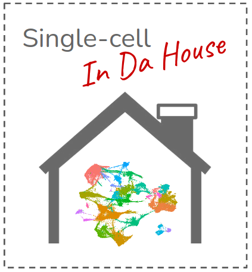

# Single-cell In Da House

"Single-cell in da house" is an open initiative that aims to form a transversal working team to integrate all researchers from the Life Sciences Department interested in the world of single-cell sequencing and its use in molecular biology.
To achieve this noble goal, we will organise regular meetings where recent scientific developments, relevant articles in the field or simply innovative (and crazy) ideas will be shared, all presented in a friendly, informal and relaxed atmosphere to encourage scientific discussion in a collaborative mood.
Are you dare to participate? If you are a real single-celler, this is definitely your group!

Rubén Chazarra & José Carbonell

